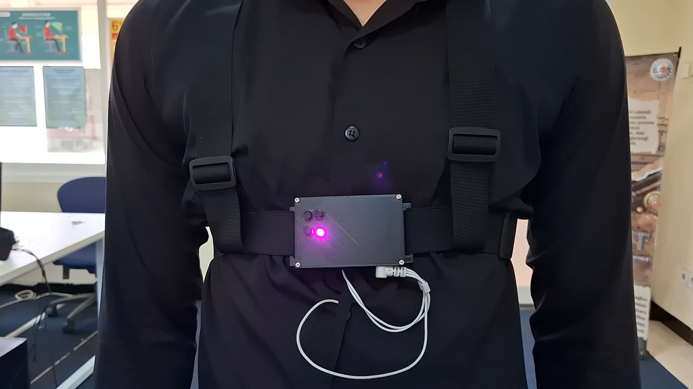
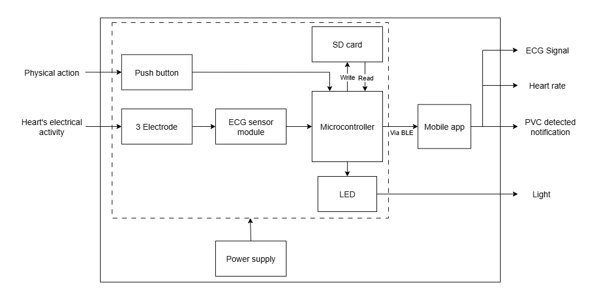

# KNN Model for PVC Detection Using Portable ECG - Final Project

## Background
According to the WHO, in 2019, cardiovascular diseases (CVDs), were the leading cause of death worldwide. This represents 32% of all global deaths, with 17.9 million people dying from them. One type of CVD is arrhythmia. Arrhythmia is characterized by an irregular heart rhythm. One type of arrhythmia is *Premature Ventricular Contractions* (PVC). People experiencing PVC can experience symptoms such as dizziness, palpitations, chest pain, or shortness of breath. Early detection of PVC is crucial to prevent serious complications. The most reliable method is an electrocardiogram (ECG). However, it is difficult for experts to analyze long-term ECG, especially since paper-based ECG devices are still used.

## Block Diagram of the System

## Hardware - IoT-based Portable ECG
- The hardware using **ESP32** to send ECG data to mobile app via BLE.
- This device uses the **ADS1293** from *Texas Instruments* as an ECG sensor.
- The hardware code includes data retrieval from sensors with a sampling rate of **267 Hz**, signal conditioning, data transmission via BLE, and data storage to an SD card.

## Software - KNN Model for PVC Classification
- The dataset for the model is from the **MIT-BIH Arrhythmia Database**.
- There are 3 features: R-R interval before the beat, R-R interval after the beat, and QRS duration.
- Produces 2 classes: Normal and PVC.
- Using **NeuroKit2** for preprocessing and features extraction.

## Acknowledgements
- [MIT-BIH Arrhythmia Database](https://physionet.org/content/mitdb/1.0.0/) as dataset.
- [NeuroKit2](https://github.com/neuropsychology/NeuroKit/tree/master/neurokit2) for ECG data preprocessing and features extraction.
